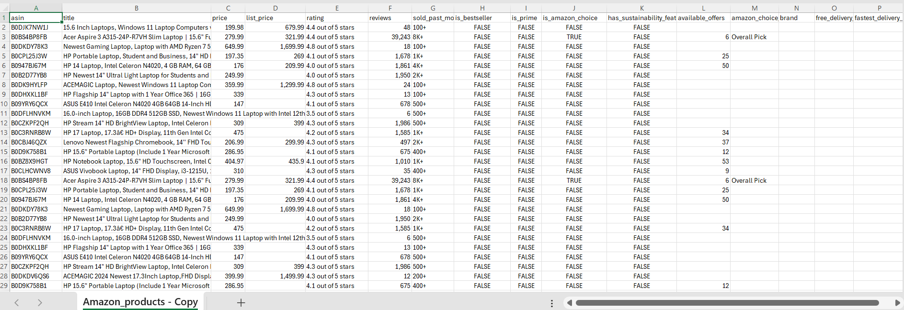
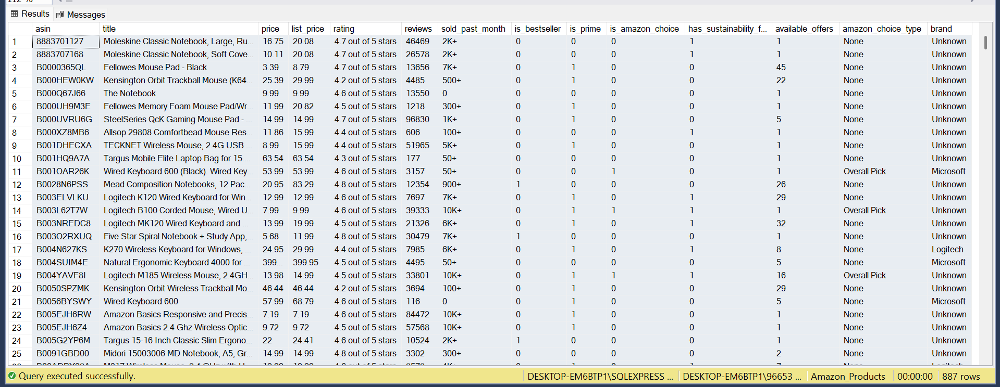

# ETL Data Pipeline Development Using SSIS for Amazon Product Data Cleaning

This project demonstrates how to clean Amazon product data using **SQL Server Integration Services (SSIS)**. Below is a detailed explanation of the process, along with before and after images for each stage.

**Data Source:** [Amazon Product Data from Kaggle](https://www.kaggle.com/datasets/mohammedalsubaie/amazon-products)

---

## Project Overview

An ETL pipeline was developed using SSIS to clean Amazon product data. The process included:

- Removing duplicates in the **ASIN** column.
- Handling missing values (NULL) in key columns such as **rating, reviews, price, list_price, brand, sold_past_month**.
- Dropping irrelevant columns like **free_delivery_date** and **fastest_delivery_date**.
- Exporting records with missing price values to Excel, and inserting complete records into a SQL Server database.

---

## Dataset Description

This dataset contains product details from Amazon Saudi Arabia, including product titles, prices (USD), ratings, reviews, and services availability like Prime and Amazon's Choice.

### Columns:

1. **asin**: Unique alphanumeric identifier assigned by Amazon for each product.
2. **title**: Product name or title.
3. **price**: Current selling price (USD).
4. **list_price**: Original price before discounts (USD).
5. **rating**: Average customer rating (1-5 stars).
6. **reviews**: Total number of customer reviews.
7. **sold_past_month**: Estimated number of units sold in the last 30 days.
8. **is_bestseller**: Whether the product is a bestseller.
9. **is_prime**: Whether the product is eligible for Amazon Prime.
10. **is_amazon_choice**: Whether the product is Amazon's Choice.
11. **has_sustainability_features**: Whether the product has sustainability certifications.
12. **available_offers**: Number of available sellers or offers.
13. **amazon_choice_type**: Amazon’s Choice category (Overall Pick, New Arrival Pick, etc).
14. **brand**: Brand name or manufacturer.
15. **free_delivery_date**: Estimated free delivery date.
16. **fastest_delivery_date**: Earliest possible delivery date.

---

## Problem Statement

The dataset faced several issues:

1️⃣ **Duplicate ASIN values**  
- The **ASIN** column, which should be unique, contained duplicates.

2️⃣ **Missing (NULL) values** in multiple columns:
- price, list_price, rating, reviews, sold_past_month, brand, free_delivery_date, fastest_delivery_date.

3️⃣ **Irrelevant columns** for analysis:
- free_delivery_date, fastest_delivery_date.

---

## Data Before and After Cleaning

📊 **Before Cleaning (Raw Excel Data):**  

📊 **After Cleaning (Data loaded into Database):**  

---

## Step-by-Step Process Using SSIS

### 1️⃣ Import Data from Excel

- Imported data using **Excel Source** component in SSIS.

---

### 2️⃣ Sort Data and Remove Duplicates

- Used **Sort Transformation** on **ASIN** to remove duplicate records.

---

### 3️⃣ Replace NULL Values

- Used **Derived Column Transformation** to replace NULL values with default values.

---

### 4️⃣ Conditional Split Based on Price Column

- Used **Conditional Split Transformation** to separate records:
  - Records with missing price values.
  - Records with valid price values.

---

### 5️⃣ Insert Cleaned Data into Database

- Inserted records with valid prices into SQL Server database using **OLE DB Destination**.

---

### 6️⃣ Export Records with Missing Prices to Excel

- Exported records with missing prices into a separate Excel file for further review.

---

## Full ETL Pipeline Flow in SSIS

### 🔄 Control Flow:

### 🔄 Data Flow:

---

## Conclusion

This project demonstrates how to clean and transform Amazon product data using **SSIS**. The ETL process involved:

- Removing duplicates.
- Handling missing values.
- Dropping irrelevant columns.
- Loading clean data into SQL Server for further analysis.

---

## Process Summary

1. Import data from Excel.
2. Sort and remove duplicate ASIN values.
3. Replace missing values with defaults.
4. Split data based on price presence.
5. Load cleaned data into SQL Server database.
6. Export incomplete records for further review.

