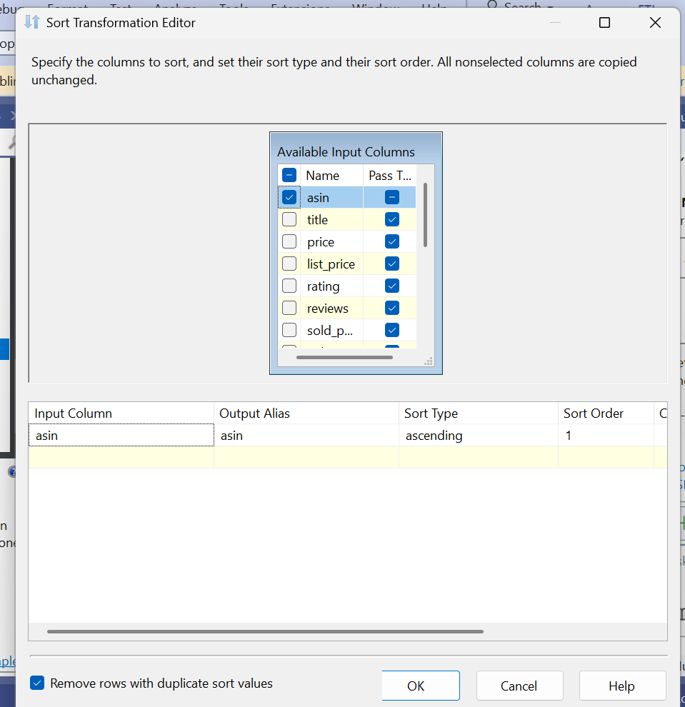
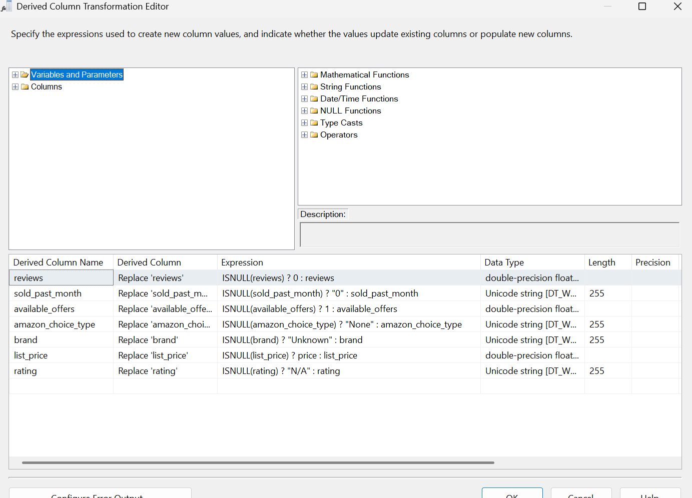
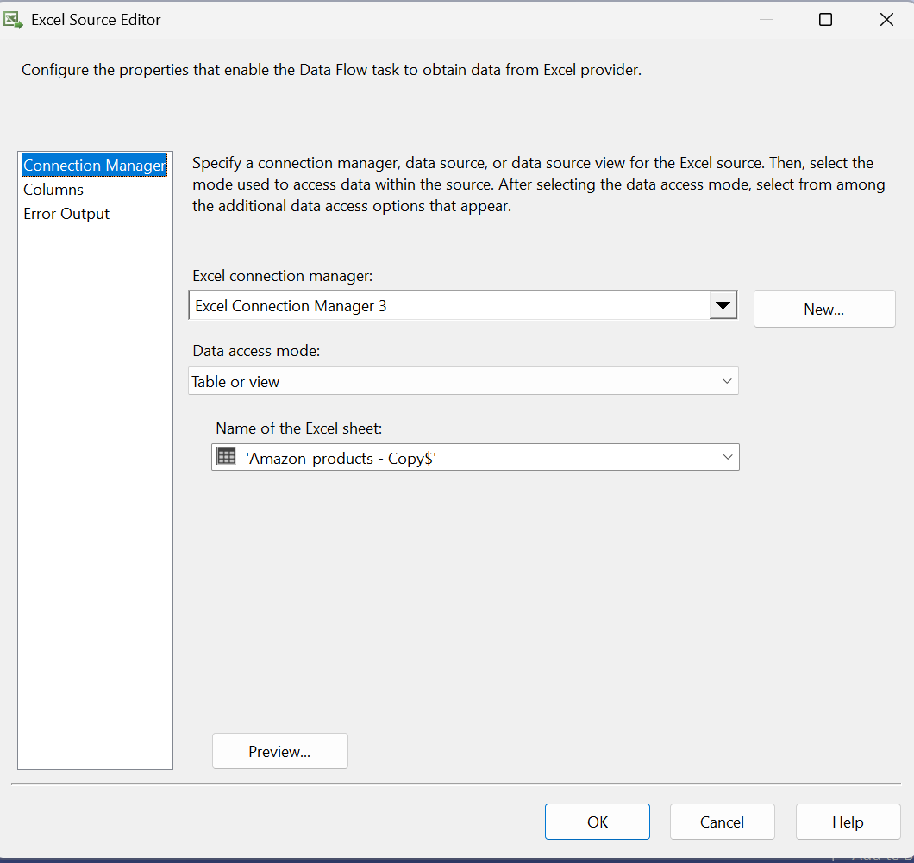
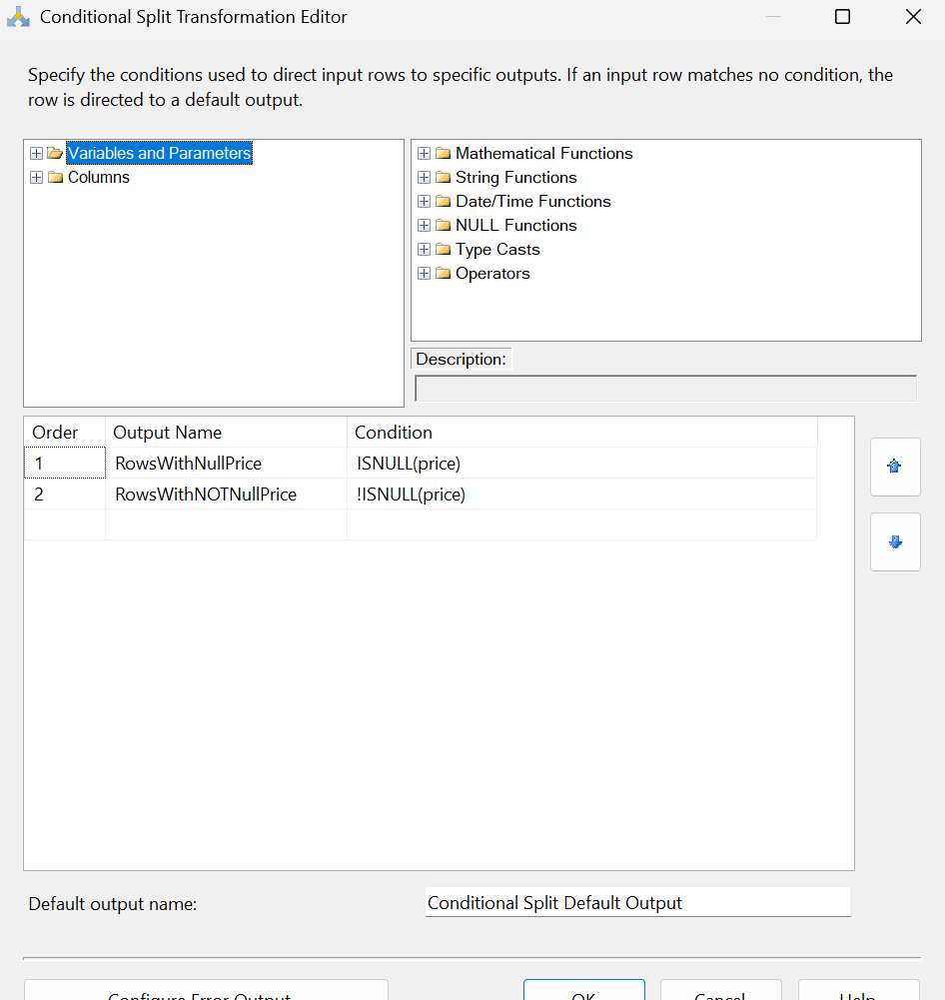
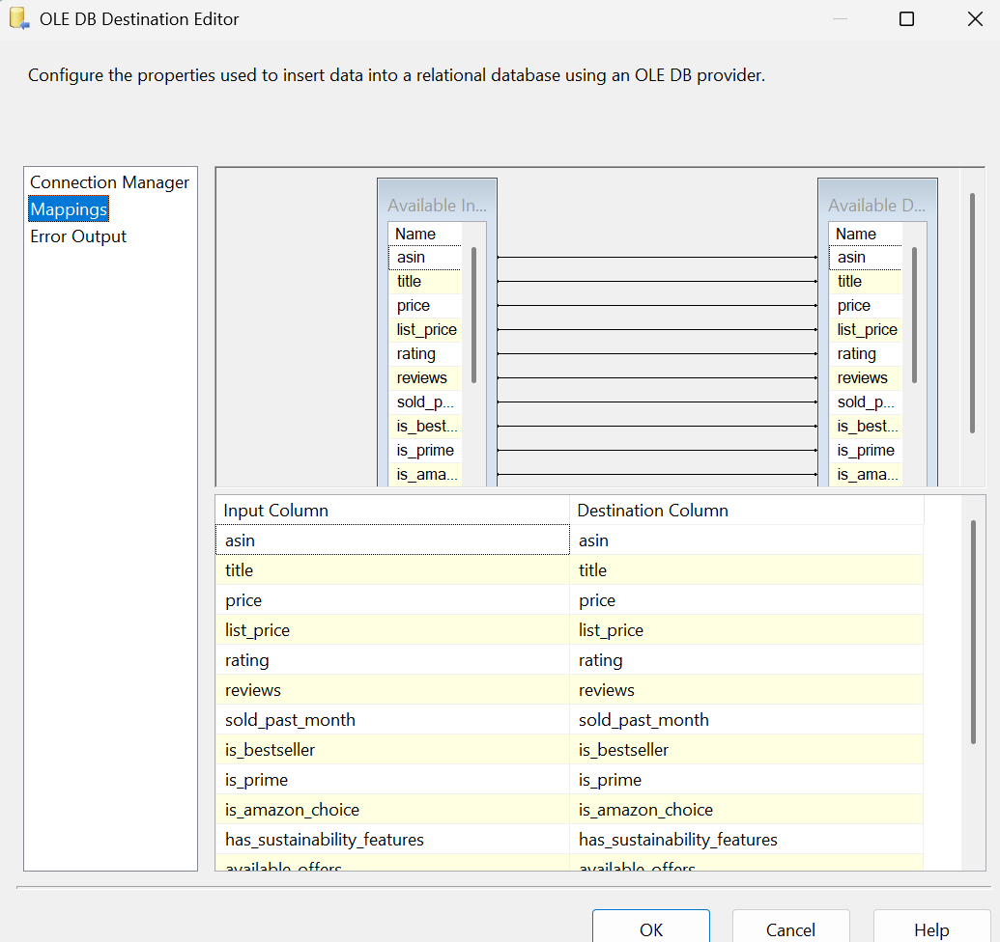

# ETL Data Pipeline Development Using SSIS for Amazon Product Data Cleanup

This project demonstrates how to clean Amazon product data using **SQL Server Integration Services (SSIS)**. Below is the step-by-step breakdown of the process, including before and after images for each phase.

**Source of Data:** [Amazon Product Data from Kaggle](https://www.kaggle.com/datasets/mohammedalsubaie/amazon-products)

---

## **Project Overview**

The **ETL pipeline** was developed using **SSIS** to clean Amazon product data. This pipeline handled several key operations:
- **Removing duplicates** in the **ASIN** column.
- **Replacing missing values (NULL)** in key columns such as **reviews**, **price**, **rating**, etc.
- **Removing irrelevant columns** that were not necessary for analysis, like **fastest_delivery_date** and **free_delivery_date**.
- **Exporting data** with missing prices to an **Excel file** and inserting data with valid prices into a **SQL database**.

---

## **Dataset Description**

This dataset provides key product information from Amazon's Saudi Arabia region, including details such as product titles, prices in USD, ratings, reviews, and availability of services like Prime and Amazon's Choice.

### Column Descriptions:

1. **asin**: A unique alphanumeric identifier assigned by Amazon to each product.
2. **title**: The name or title of the product as displayed on Amazon.
3. **price**: The current selling price of the product (in USD).
4. **list_price**: The original price of the product before any discounts are applied (in USD).
5. **rating**: The average customer rating for the product, typically on a scale of 1 to 5 stars.
6. **reviews**: The total number of customer reviews the product has received.
7. **sold_past_month**: The estimated number of units sold in the last 30 days.
8. **is_bestseller**: Indicates whether the product is a bestseller in its category.
9. **is_prime**: Indicates whether the product is eligible for Amazon Prime benefits.
10. **is_amazon_choice**: Indicates whether the product is "Amazon's Choice".
11. **has_sustainability_features**: Indicates whether the product has sustainability certifications or features.
12. **available_offers**: The number of different sellers or offers available for the product.
13. **amazon_choice_type**: The search term or category for which the product is designated as (e.g., "Overall Pick", "New Arrival Pick").
14. **brand**: The name of the brand or manufacturer of the product.
15. **free_delivery_date**: The estimated date the product will be delivered with free shipping.
16. **fastest_delivery_date**: The earliest possible delivery date, usually with expedited shipping options.

---

## **Problem Statement**

The dataset provided by Amazon had several issues that made it unsuitable for analysis:

### 1. **Duplicate ASIN values**:
- **ASIN**, which should be a unique identifier for each product, contained duplicate values.
- This caused multiple entries for the same product.

### 2. **Missing (NULL) values in multiple columns**:
- Columns like **price**, **list_price**, **rating**, **reviews**, **sold_past_month**, **brand**, **free_delivery_date**, and **fastest_delivery_date** contained many **NULL** values.

### 3. **Irrelevant columns**:
- Due to the age of the data, columns like **free_delivery_date** and **fastest_delivery_date** were identified as irrelevant and should be removed.

---

## **Solution Using SSIS**

### **1. Removing Duplicates in ASIN Column**
We used the **Sort** component in the **Data Flow Task** to sort data by **ASIN** and remove duplicates, ensuring only one unique record for each **ASIN**.



---

### **2. Replacing NULL Values**
We used the **Conditional Split** and **Derived Column** transformations to handle **NULL** values in the following columns:

- **reviews**: Replaced `NULL` with `0`.
- **sold_past_month**: Replaced `NULL` with `"0"`.
- **available_offers**: Replaced `NULL` with `1`.
- **amazon_choice_type**: Replaced `NULL` with `"None"`.
- **brand**: Replaced `NULL` with `"Unknown"`.
- **list_price**: Replaced `NULL` with the value from the **price** column.
- **rating**: Replaced `NULL` with `"N/A"`.



---

### **3. Removing Irrelevant Columns**
We used **Execute SQL Task** to remove the unnecessary columns **free_delivery_date** and **fastest_delivery_date**. Below is the SQL code used:

```sql
DECLARE @sql AS NVARCHAR(MAX);

-- Check if the 'fastest_delivery_date' column exists and drop it if it does
IF EXISTS (SELECT * FROM INFORMATION_SCHEMA.COLUMNS WHERE TABLE_NAME = 'NEW' AND COLUMN_NAME = 'fastest_delivery_date')
BEGIN
    SET @sql = 'ALTER TABLE NEW DROP COLUMN fastest_delivery_date';
    EXEC sp_executesql @sql;
END;

-- Check if the 'free_delivery_date' column exists and drop it if it does
IF EXISTS (SELECT * FROM INFORMATION_SCHEMA.COLUMNS WHERE TABLE_NAME = 'NEW' AND COLUMN_NAME = 'free_delivery_date')
BEGIN
    SET @sql = 'ALTER TABLE NEW DROP COLUMN free_delivery_date';
    EXEC sp_executesql @sql;
END;
````

---

## **Step-by-Step Process Using SSIS**

### **1. Import Data from Excel**

First, we import data from an **Excel file** using the **Excel Source** component in SSIS.

**Explanation:**

* The **Excel Connection Manager** is configured to connect to the Excel file, and the relevant sheet is selected for import.



---

### **2. Sort Data by ASIN and Remove Duplicates**

We use the **Sort** transformation to sort the data based on the **ASIN** column and remove duplicate records.

**Explanation:**

* The **Remove rows with duplicate sort values** option is enabled to eliminate duplicate **ASIN** values.


---

### **3. Replace NULL Values**

We replace **NULL** values in key columns using the **Derived Column Transformation**.

**Explanation:**

* Columns like **reviews**, **sold\_past\_month**, and **rating** are checked for **NULL** and replaced with default values.


---

### **4. Split Rows Based on Null or Non-Null Price Values**

The **Conditional Split** transformation is used to split the data into two paths:

1. Rows with **NULL** values in **price** are routed to **Rows with Null Price**.
2. Rows with non-null values in **price** are routed to **Rows with Non-Null Price**.

**Explanation:**

* This allows us to process rows with missing prices separately from rows with valid prices.



---

### **5. Insert Data into Database**

Rows with **non-null** **price** values are inserted into the **database** using the **OLE DB Destination**.

**Explanation:**

* **Rows with Non-Null Price** are inserted into the **Amazon Products** table in the database.



---

### **6. Export Rows with Null Price to Excel**

Rows with missing **price** values are exported to an **Excel file**.

**Explanation:**

* **Rows with Null Price** are exported to a separate **Excel file** for further review.

---

## **Conclusion**

This project demonstrates how to clean and transform Amazon product data using **SSIS**. The **ETL process** ensures that the data is cleaned, transformed, and loaded correctly into the database for further analysis.

---

### **Summary of Steps**:

1. **Import Data from Excel**: Import the raw data from the Excel sheet.
2. **Sort and Remove Duplicates**: Ensure that each product is unique by removing duplicate **ASIN** values.
3. **Replace NULL Values**: Handle missing values by replacing them with meaningful defaults.
4. **Split Rows Based on Price**: Separate rows with missing prices for further handling.
5. **Insert Data into Database**: Insert cleaned data into the database.
6. **Export Data with Null Price**: Export rows with missing prices for further review.

This process ensures that the product data is cleansed, transformed, and stored in a usable format for further analysis.

---

### **Steps for Uploading on GitHub**:

1. **Upload Images to GitHub**:

   * Create a folder named **images** in your GitHub project.
   * Upload all the images used in this process into this folder.

2. **Upload README.md File**:

   * Upload the **README.md** file with the detailed description and images to your GitHub repository.
   * Ensure that the images display correctly next to their respective explanations.

```

